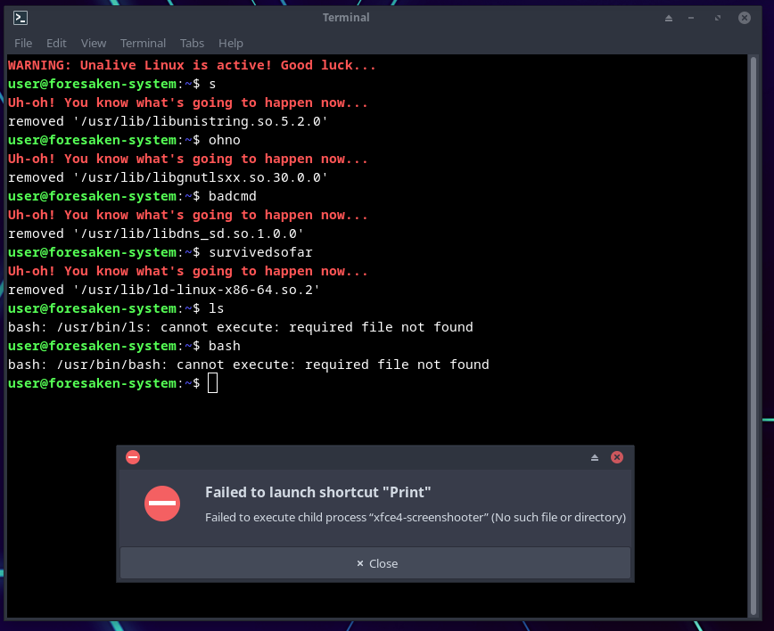

# unalive-linux
Mercilessly punish users when they type an incorrect command.

# About


**Unalive Linux** is a modern, enhanced and re-imagined implementation of
[Suicide Linux](https://qntm.org/suicide). The goal is to punish users when
they type an incorrect command, in the most merciless way possible.

The original **Suicide Linux** worked by resolving any bad command into the
notorious `rm -rf /*`. **Unalive Linux**, instead, removes one system library
at a time, thus gradually rendering the system more and more broken after every
bad command. It's like a game of Russian roulette, or a minefield - will you
lose the core C library (`libc.so.6`), which EVERY program and service on your
system depends on, or will you dodge the danger and only lose a superflous
library like `libraw1394.so.11.1.0`? Now the question really is, how long can
you survive while your system is still usable?

# Installation
**NOTE:** Unalive Linux works best with polkit! Ensure polkit is installed on
your system and the `pkexec` command is usable. If `pkexec` is not found, the
program will fallback to `sudo`. However, it doesn't install a rule for sudo
like it does for polkit, so most of the immersion will not be present!

To install **Unalive Linux**, clone the repository with the following command:
```
git clone https://github.com/DanielMYT/unalive-linux
cd unalive-linux
```
Then install it with the following command:
```
sudo make install
```
**WARNING:** After running the above command, **Unalive Linux** will activate
the next time you log into your system. So if you want to change your mind and
back-out now, before it's too late, run the following command to undo the
installation:
```
sudo make uninstall
```
